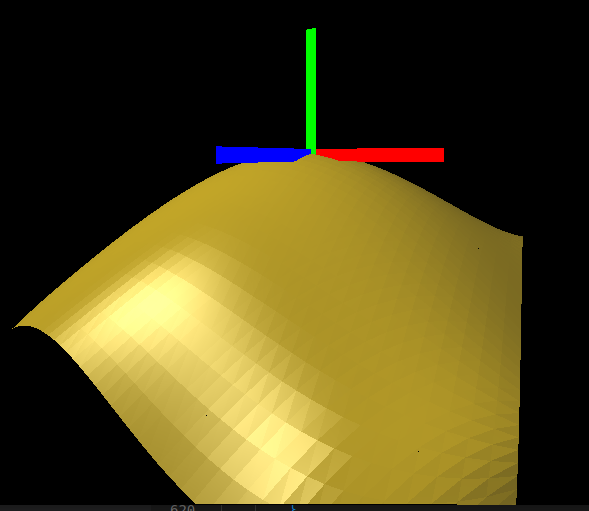

# Interactable Bezel Surface Viewer

Generates a 3D surface that is controlled by 16 real-time adjustable weight points. 

The guide for using this program, theories related to bezel curve & surface, and this program's implementation are written in the documentation.

This program is built upon a basic 3D mesh viewer authored by unknown, that is also based on openCV.

Preview of the program:

The curve mesh can be modified into one with higher resolution:

